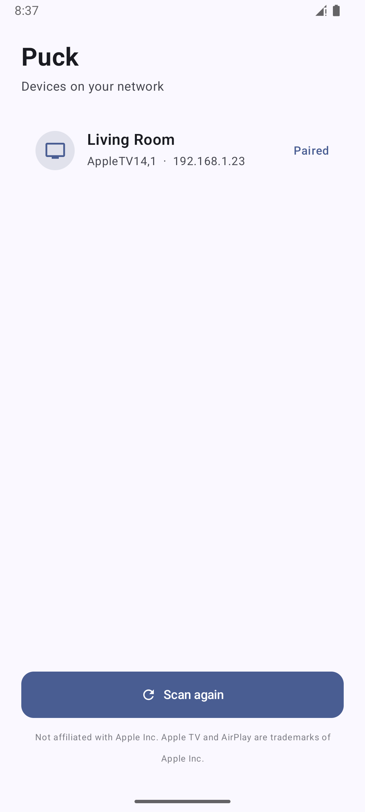
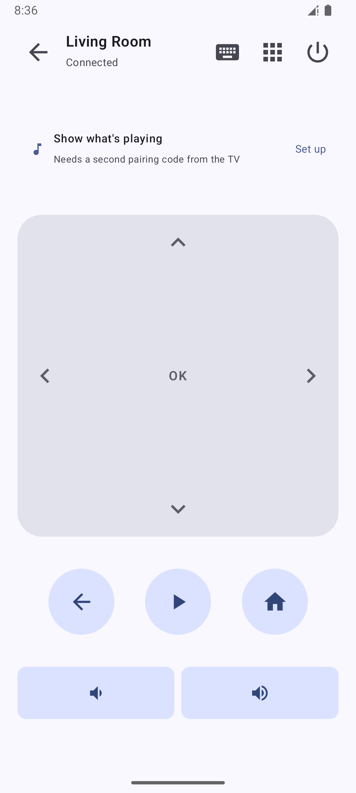
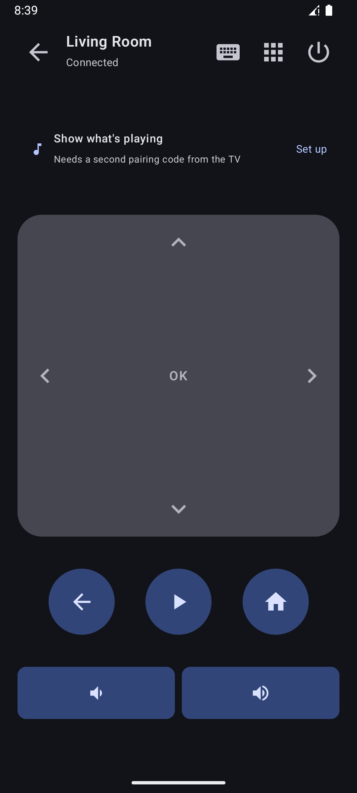
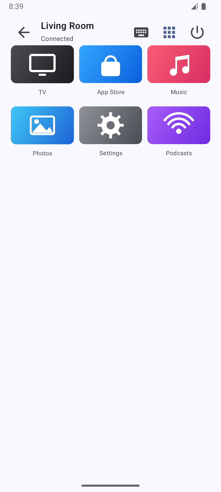

<div align="center">


# Puck

**A native Android remote for Apple TV — built to control more than one.**

[](https://github.com/iamclements/puck/actions/workflows/ci.yml)
[](https://github.com/iamclements/puck/releases/latest)
[](LICENSE)
[](https://www.conventionalcommits.org/en/v1.0.0/)

</div>

Puck speaks Apple's Companion Link protocol natively in Kotlin — no companion
server, no Python bridge, nothing else to run. Just an APK on your phone,
talking straight to your Apple TV over the LAN.

> **Not affiliated with Apple Inc.** "Apple", "Apple TV", "AirPlay" and "Siri"
> are trademarks of Apple Inc., registered in the U.S. and other countries,
> used here solely to describe compatibility.

<p align="center">
  
  
  
  
</p>

## Features

- **Multiple Apple TVs, properly paired.** Discovery finds every Apple TV on
  your network, and Puck keeps more than one paired at a time — switch between
  them from one list instead of re-pairing every time you change rooms.
- **A D-pad that works like the real remote.** Tap a direction for one step,
  hold to repeat, or drag anywhere on the pad to pan and momentum-scroll —
  one surface, not an analogue joystick.
- **Menu, Home, Play/Pause, Power** — the play button reflects real playback
  state; power taps open Control Centre and holds wake a sleeping Apple TV,
  same as the hardware remote.
- **App drawer** with real tvOS app icons, fetched from the App Store.
- **Text entry** straight from your phone's keyboard, including a lock-screen
  reply field when the TV asks for text while your phone is locked.
- **Now playing** — artwork, a draggable scrubber, skips and volume, backed by
  a full media notification and lock-screen controls.
- **Home-screen widget, Quick Settings tiles, and launcher shortcuts** — jump
  straight into a specific Apple TV without opening the app first.
- **Material You** dynamic colour on Android 12+.

See [`docs/ARCHITECTURE.md`](docs/ARCHITECTURE.md) for how the protocol layer
and Android app are put together — Companion Link pairing, the AirPlay/MRP
now-playing tunnel, and the module layout.

## Download

| Source | Status |
|---|---|
| [GitHub Releases](../../releases) | ✅ Signed APK, available now |
| Google Play | 🚧 Coming soon |
| F-Droid | 🚧 Submission pending a tagged release — recipe ready at [`docs/fdroid/`](docs/fdroid/) |

Requires **Android 8.0 (API 26)** or newer, on the same Wi-Fi network as the
Apple TV. Installing the GitHub release needs "allow installation from unknown
sources" since it isn't yet on a store.

## Pairing

1. Open the app and tap your Apple TV.
2. Enter the 4-digit code shown on the TV. **The code expires quickly** — if
   pairing stalls, cancel and try again for a fresh code.
3. Optionally tap **Show what's playing** to enable now-playing, which needs a
   second, independent pairing with its own code.

Credentials are encrypted with a key held in the Android Keystore. They grant
full control of the Apple TV, so treat them like a password.

## Compatibility

Verified end-to-end against an **Apple TV 4K (AppleTV14,1) running tvOS 26.6**.
The Companion Link protocol has been stable since tvOS 13, so other models and
versions from that era onward are expected to work, but are untested — please
open an issue either way, reports of what works are as useful as bug reports.

Apple TV 3rd generation and earlier are **not** supported; they use the older
DMAP protocol, which modern devices have dropped entirely.

Volume controls appear only when the Apple TV reports it can route volume. A
Siri Remote that changes volume over infrared never puts the Apple TV in the
path, so no network client — Puck included — can control it there; volume is
expected to work on HDMI-CEC setups instead.

## Security

See [PRIVACY.md](PRIVACY.md) for the plain-language version of what leaves
your device and what doesn't.

- Pairing credentials are encrypted with an AES-GCM key held in the Android
  Keystore, non-extractable on most devices. Backups are disabled, since
  Keystore-wrapped ciphertext cannot be restored onto other hardware.
- No analytics, no account. The app requests only the network and
  notification permissions the remote and media controls need.
- **One request leaves your network:** the app drawer looks up each app's icon
  against Apple's public iTunes endpoint, so Apple learns which apps are
  installed on your TV. Everything else — the remote itself, pairing,
  now-playing — works entirely on the LAN.

Found a security issue? Please open an issue.

## Building

Requires **JDK 21** (Android Gradle Plugin does not support JDK 25) and the
Android SDK with platform 35.

```bash
./gradlew :app:assembleDebug      # installable debug APK
./gradlew :app:assembleRelease    # minified, ~3 MB
./gradlew :protocol:test          # conformance tests
```

A `cli/` module exists for exercising the protocol from a terminal without a
phone — see [`docs/ARCHITECTURE.md`](docs/ARCHITECTURE.md#correctness) for
details.

## Contributing

Contributions are welcome — especially **compatibility reports** for models
and tvOS versions other than the one tested.

Please run `./gradlew :protocol:test` before opening a pull request. If you
change protocol behaviour, add a conformance vector rather than only a
round-trip test: self-consistency proves nothing about what a real device
accepts.

Commits follow [Conventional Commits](https://www.conventionalcommits.org/en/v1.0.0/)
(`feat: ...`, `fix: ...`, `docs: ...`, and so on) — CI checks this on every
pull request. `./gradlew :app:lintDebug` also runs in CI and is worth a local
run before pushing.

## Credits

Puck is a fork of [**Remote for Apple
TV**](https://github.com/msthind04/AppleTV-Remote) by
[msthind04](https://github.com/msthind04) — the original protocol work
(Companion Link, AirPlay/MRP, the SRP6a/HAP pairing handshake, OPACK and
binary-plist codecs) and remote-control UI come from that project. This fork
renames the app, adds persistent multi-device support with home-screen
quick-action shortcuts, widgets and Quick Settings tiles, and carries its own
visual design going forward. See `git log` for the full history of what
changed after the fork point.

Protocol knowledge and test vectors are derived from
[pyatv](https://github.com/postlund/pyatv) (MIT). See
[THIRD_PARTY_NOTICES.md](THIRD_PARTY_NOTICES.md).

## Licence

Licensed under the [Apache License 2.0](LICENSE), like the original — see
[NOTICE](NOTICE).

Companion Link is an undocumented Apple protocol; this is a clean-room-style
implementation built from public reverse-engineering work. It controls
hardware you own, on your own network.
